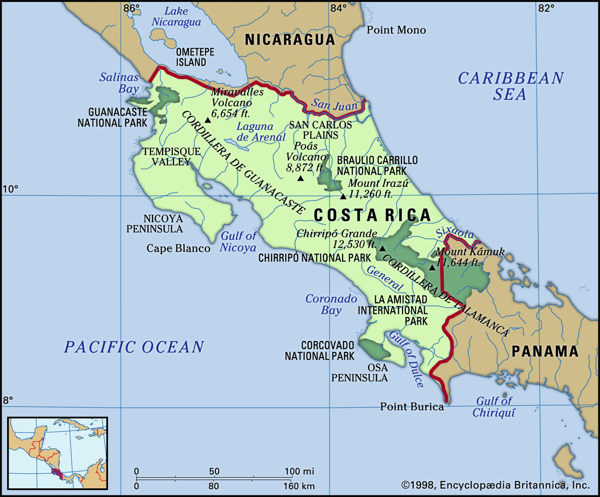
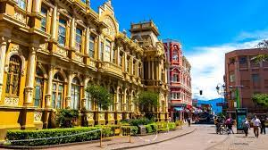
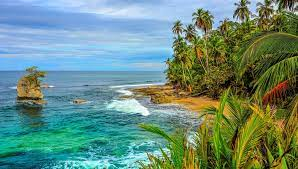
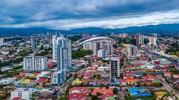
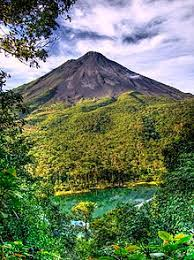

## 5 fun facts about Costa Rica

Costa Rica is a beautiful country known for its stunning landscapes, biodiversity, and vibrant culture. Here are five fun facts about Costa Rica.

**1.Happiest Country in the World:** According to the Happy Planet Index, Costa Rica held the top position as the happiest country in the world in 2012 (in 2024 it turned 12 on the list).This ranking is influenced by various factors, including the government's investment in public services like education and healthcare.

**2.Rich Coast:** The name *"Costa Rica"* translates to *"Rich Coast"* in Spanish, given by the Spaniards because of the country's gorgeous coastline.

**3.Abolished Army:** Costa Rica is one of the few countries in the world without a standing army. The Costa Rican army was abolished in 1949 following a 44-day civil war, and the country has since focused on maintaining a peaceful and neutral stance.

**4.Biodiversity Hotspot:** Despite its small size, Costa Rica is home to an incredible amount of biodiversity. It covers just 0.03% of the Earth's surface but contains around 5% of the world's biodiversity 

**5.Renewable Energy Leader:** Costa Rica is a global leader in renewable energy. The country generates most of its energy using five renewable sources: hydropower, wind, geothermal energy, biomass, and solar.

These fun facts about Costa Rica highlight the country's commitment to sustainability, its natural beauty, and its unique cultural heritage. Whether you're interested in exploring its rainforests, relaxing on its stunning beaches, or immersing yourself in its vibrant culture, Costa Rica has something for everyone.